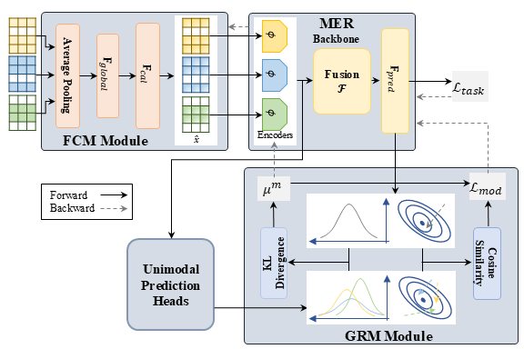

# BALM in PyTorch

This is the official PyTorch implementation of BALM proposed in ''*BALM: A Model-Agnostic Framework for Balanced Multimodal Learning under Imbalanced Missing Rates*'', a model-agnostic plug-in framework to achieve balanced multimodal learning under IMR.

## Motivation & Method

Imbalanced Missing Rate introduces two coupled challenges:

1. Representation imbalance: heterogeneous missing patterns distort unimodal feature distributions and hinder consistent cross-modal fusion; 
2. Learning imbalance: gradients are dominated by frequently observed modalities, leading to biased convergence.

To this end, we propose **BALM** (**B**alanced **A**gnostic **L**earning under Imbalanced **M**issing Rates) comprising two complementary modules:

- Feature Calibration Module (FCM) that aligns representations across varying missing patterns
- Gradient Rebalancing Module (GRM) that harmonizes optimization dynamics by adaptively modulating gradient magnitudes and directions

<div align="center"> 

</div>

## Dependencies

- python 3.11
- Required packages specified in `requirements.txt`
- comet_ml (optional, for experiments tracking)

## Usage

### Core Code

We demonstrate the integration of BALM with 2 MER models, namely MMGCN and MM-DFN, in their respective directory. Both directories follow similar structure, with core files/directores as below:

```
<BACKBONE>/
├── scripts/
├── BALM.py
├── train.py
└── model.py
```

Implementation of FCM and GRM modules are in the file `BALM.py`. FCM is used as a module of the backbone (see `model.py`) while GRM is used as a seperated module (see `train.py`). Example scripts for training with backbone-specific hyperparameters are provided in the directory `scripts/`.

The abstract code of BALM in action in training is as following:

```python

    --- init ---
    mod = GRM() # gradient modulation module
    optimizer = optim.Adam() # optimizer of backbone
    cls_optimizer = optim.Adam() # optimizer of unimodal prediction heads

    ---in training step---

    # Compute overall loss by aggregating task loss with modulation loss
    loss = loss_fn(log_prob, label)
    loss += tau * mod.loss_gm

    # Compute backbone's gradients at current step
    loss.backward()

    # Modulate backbone's gradients, update modulation loss for next training step, and update unimodal prediction heads
    mod.get_loss()
    cls_optimizer.step()
        
    # Update backbone
    optimizer.step()
    
    ---continue for next training step---
```

### Hyper-parameter Settings

Backbone's specific hyper-parameters are set as provided in their official documentations. Below are BALM's hyper-paramenters setting and training configuration for IEMOCAP and CMU-MOSEI.

|      Parameter      |   IEMOCAP  |  CMU-MOSEI |
| :-----------------: | :--------: | :--------: |
|       $d_a$       |    1582    |     512    |
|       $d_l$       |    1024    |    1024    |
|       $d_v$       |     342    |    1024    |
|       $\tau$      | (0.2, 0.8] | (0.2, 0.8] |
|       $\rho$      | (1.1, 1.6] | (1.1, 1.6] |
| $d_\text{global}$ |     737    |     640    |
|      batch size     |     16     |     32     |
|        epochs       |     80     |     25     |

**Notes:**
Above is the settings for $\tau$, $\rho$, $d_\text{global}$ we have used in our experiements. We select $d_\text{global}=(d_a+d_l+d_v)/div$ (default $div=4$).

## Citation

If you find this work useful, please consider citing it.
